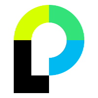
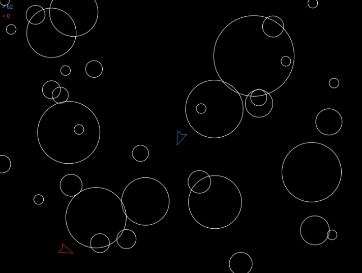

title: TWeb
subtitle: <i class="fas fa-tasks"></i> Introduction
author: Bertil Chapuis
class: animation-fade
layout: true

<!-- This slide will serve as the base layout for all your slides -->

---

class: inverse center middle

# {{title}}

## {{subtitle}}

{{author}}

---

# <i class="fas fa-user"></i> Chargé de Cours et Assistants
.left-column[

]

.right-column[
## Bertil Chapuis

bertil.chapuis@heig-vd.ch

Security & Privacy Researcher

Université de Lausanne

## Guillaume Serneels

## Gabriel Luthier

]

## 
---

# <i class="fas fa-user"></i> Slides

Les slides et les liens importants sont disponnible ici <i class="fas fa-hand-point-down"></i>

https://tweb-classroom.github.io/slides/

---

# <i class="fas fa-graduation-cap"></i> Connaissances Préalables

-   Programmation orientée objets
-   Programmation réseau (Socket API, TCP, UDP)
-   Protocole HTTP

---

# <i class="fas fa-cog"></i> Technologies

.left-column[
## Client
]

.right-column[
Le développement web coté client sera réalisé en:
- HTML
- CSS
- Javascript

Utilisez votre browser favoris en gardant à l'esprit que [Chrome](https://www.google.com/chrome/) sera utilisé pour:
- les démonstrations
- les [outils de développement](https://developers.google.com/web/tools/chrome-devtools/)
- la corrections des travaux pratiques

Le framework [VueJS](https://vuejs.org/) sera abordé pour mieux comprendre les notions de progressive framework et declarative rendering.

]

---

# <i class="fas fa-cog"></i> Technologies 

.left-column[
## Client
## Server
]

.right-column[
Le développement web coté serveur sera réalisé avec:
- [Node & NPM](https://nodejs.org/en/)
- [ExpressJS](https://expressjs.com/)

Les libraries suivante seront abordées:
- [Mocha](https://mochajs.org/) pour les tests unitaires
- [Selenium](https://www.seleniumhq.org/) pour les tests d'interface
- [Passeport](http://www.passportjs.org/) pour l'authentification
- [GraphQL](https://graphql.org/) pour manipuler des APIs

]

---

# <i class="fas fa-cog"></i> Technologies

.left-column[
## Client
## Server
## Container
]

.right-column[
Les projets seront testés, deployés et rendu à avec [docker](https://www.docker.com/products/docker-desktop).

Vérifiez votre installation lors du premier labo.
]

---

# <i class="fas fa-cog"></i> Technologies

.left-column[
## Client
## Server
## Container
## IDE
]

.right-column[
Utilisez votre environnement préféré en gardant à l'esprit que
[Visual Studio Code](https://code.visualstudio.com/) sera utilisé pour les démonstrations.

L'installation des extensions suivantes est recommendée:
- Debugger for Chrome
- Docker
- ESLint
- HTML CSS Support
- Mocha sidebar
- Prettier
- Vetur
]

---

# <i class="fas fa-tasks"></i>Plan de Cours

## Objectif d'apprentissage

Comprendre et connaitre les fondamentaux du web en tant que plateforme pour mieux appréhender les libraries et technologies qui le composent.

## Plan de cours indicatif

48 périodes réparties de la manière suivante:

- Introduction au développement web (*3 périodes*)
- Introduction à Javascript (*3 périodes*)
- Pratiques du génie logiciel avec Javascript (*12 périodes*)
- Javascript du côté navigateur (*6 périodes*)
- Javascript du côté serveur (*6 périodes*)
- Comprendre l'écosystème javascript (*6 périodes*)
- Authentification en javascript (*3 périodes*)
- Sécuriser les applications web (*3 périodes*)
- Intervenants externes (*3 périodes*)
- Révisions (*3 périodes*)
---

# <i class="fas fa-users-cog"></i> Travaux pratiques

Les travaux pratiques seront réalisés en groupes (maximum 4). Les groupes ne changent pas durant le semestre.

.left-column[
## Exercices
]

.right-column[
Une version multi-joueurs du jeu asteroids est décomposée en plusieurs exercices (n: 6-7). 

Les exercices doivent être rendu dans un délai d'une semaine le mardi à 12h précise.

Démonstration...
]

---

# <i class="fas fa-users-cog"></i> Travaux pratiques

Les travaux pratiques seront réalisés en groupes (maximum 4). Les groupes ne changent pas durant le semestre.

.left-column[
## Exercices
## Projet
]

.right-column[
Implémenter et documenter deux améliorations *significatives* au jeu vidéo.

### Exemples
- Créer une plateforme de gestion des parties
- Sécuriser l'ensemble de l'application
- Faire le rendu du jeu avec WebGL
- Communiquer avec  WebRTC
- Améliorer le gameplay
- Implémenter une IA

### Soyez créatifs... ;)
]

---

# <i class="fas fa-graduation-cap"></i> Evaluation

- Exercices guidés (20%)
- Projet (20%)
- Examen intermédiaire (20%)
- Examen final (40%)
---

# <i class="fas fa-window-restore"></i>  Plateforme d'enseignement

- [Github Classroom](https://classroom.github.com/classrooms/54867215-tweb-classroom) est utilisé pour former les groupe et rendre les travaux pratiques.

- [Github Organisation]() est utilisé pour stocker le support de cours, le code source et les exemples vu en cours.

- [Telegram](https://t.me/joinchat/AAAAAFg5D6epsXCYE41Ozg) est utilisé pour diffuser les informations liées au cours.

- [Speakup](http://speakup.info/) est utilisé pour les questionnaires de révision afficher en cours.

---

class: center middle

# <i class="fas fa-hand-paper"></i> Questions ?

