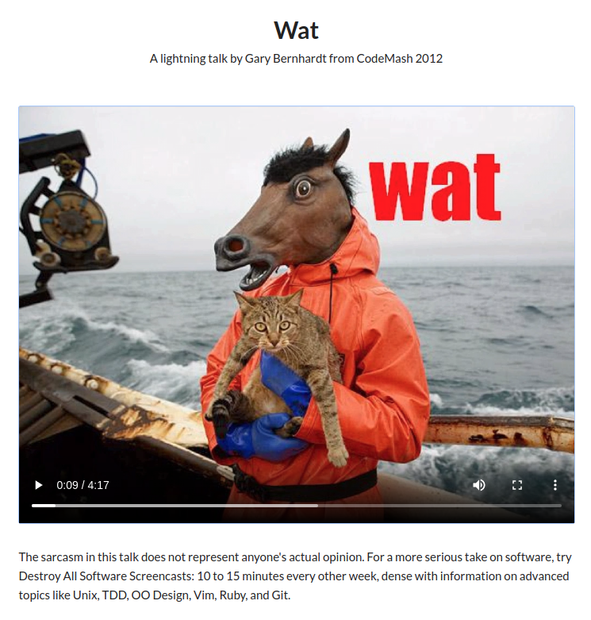
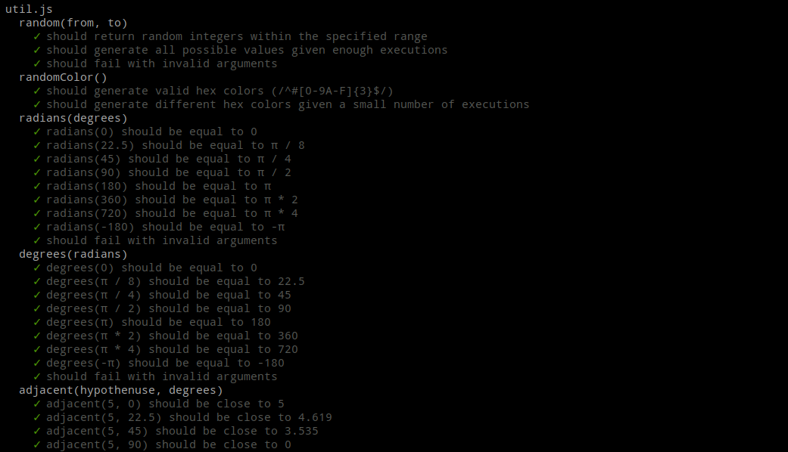

title: TWeb
subtitle: <i class="fas fa-tasks"></i> Object-oriented JavaScript
author: Bertil Chapuis
class: animation-fade
layout: true

<!-- This slide will serve as the base layout for all your slides -->

---

class: inverse center middle

# {{title}}

## {{subtitle}}

<p style="margin-top: 40px">{{author}}</p>

---

## <i class="fas fa-tasks"></i> Overview of Today's Class

- Wat (Video)

- Quiz about last week's lecture

- Correction of last week's assignment

- Object-oriented JavaScript

- Manipulating DOM objects

- Drawing in the HTML Canvas

- More about Chrome DevTools

- Introduction of next week's assignment

---

.center[
<a href="https://www.destroyallsoftware.com/talks/wat">

</a>
]

---

class: inverse center middle

#  <i class="fas fa-question-circle"></i> Quiz

---

# <i class="fas  fa-question-circle"></i> Speakup

You can answer to the following Quiz on Speakup.

http://www.speakup.info/

Room Number:  **XXXXX**

Once connected, answer to the first test question.

---

# <i class="fas fa-question-circle"></i> Question 1

Cochez la ou les affirmations correcte(s) à propos de Javascript:

- JavaScript est un language compilé

- JavaScript est un language interpreté

- JavaScript est un language statique

- JavaScript est un language dynamique

- JavaScript est un language orienté objet

- JavaScript est un language orienté prototype

- Aucune affirmation correcte

---

# <i class="fas fa-question-circle"></i> Question 2

Quelle est la visibilité (scope) d'une variable définie avec le mot clé var en dehors d'une fonction?

- Sa visibilité est globale

- Sa visibilité est locale

- Sa visibilité est limitée au bloque courant

- Aucune réponse correcte

---

# <i class="fas fa-question-circle"></i> Question 3

Quelle est la valeur imprimée par le programme suivant?

```js
console.log("PI = ${Math.PI}");
```

- `"PI = 3.141592653589793"`

- `"PI = ${Math.PI}"`

- `"PI = 3.14"`

- `"PI = ${3.141592653589793}"`

- Aucune réponse correcte

---

# <i class="fas fa-question-circle"></i> Question 4

Quelle est la valeur imprimée par le programme suivant?

```js
let i = 0;
console.log(i++);
```

- `0`

- `1`

- `Error`

- `undefined`

- Aucune réponse correcte


---

# <i class="fas fa-question-circle"></i> Question 5


Quelle est la valeur imprimée par le programme suivant?

```js
var x = "1";
if (x == 1) {
    var x = 2;
}
console.log(x);
```

- `1`
- `"1"`
- `2`
- `"2"`
- `null`
- Aucune réponse correcte

---

# <i class="fas fa-question-circle"></i> Question 6

Quelle est la valeur imprimée par le programme suivant?

```js
function fun(value) {
  let v = value;
  return () => v++;
}
let f = fun(10);
for (let i = 0; i < 10; i += 2) f();
console.log(f());
```

- `10`

- `11`

- `14`

- `15`

- `16`

- `20`

- Aucune réponse correcte


---

class: inverse center middle

# <i class="far fa-edit"></i> Correction


---

.center[

]

---

class: center middle


# <i class="fas fa-hand-paper"></i> Questions ?

---

class: inverse center middle

# <i class="fab fa-js"></i> Object-oriented Javascript

---


## <i class="fab fa-js"></i> Recall JavaScript's Types

ECMAScript defines 7 **primitive** (Immutable) types for values.

```js
3.14; // Number
true; // Boolean
"Heig-vd"; // String
undefined; // Undefined
null; // Null
9007199254740992n; // BigInt
Symbol("Symbol") // Symbol
```

ECMAScript defines a special mutable type called **object** for collections of properties (objects and array).

```js
{prop: "value"}; // Object
```

In a dynamic language you don't specify the type when you declare a variable and the type of a variable can change.

.footnote[.red[*] https://developer.mozilla.org/en-US/docs/Web/JavaScript/Data_structures#Data_types]

---

## <i class="fab fa-js"></i> More about Object .red[*]

An object is a collection of properties, and a property is an association between a name (or key) and a value.

```js
let car = {
    make: 'Ford',
    model: 'Mustang',
    year: 1969
}
```

You access the properties of an object with a simple **dot-notation** (property names: `"^[a-z]+(_[a-z]+)+$"`):

```js
let car = new Object();
car.make = 'Ford';
car.model = 'Mustang';
car.year = 1969;
```

Properties of JavaScript objects can also be accessed or set using a **bracket notation**:

```js
car['make'] = 'Ford';
car['model'] = 'Mustang';
car['year'] = 1969;
```

.footnote[.red[*] https://developer.mozilla.org/en-US/docs/Web/JavaScript/Guide/Working_with_Objects]

---

## <i class="fab fa-js"></i> Consider the Array object .red[*]

The JavaScript `Array` object is a global object that is used in the construction of arrays; which are high-level, list-like **objects**.

```js
var fruits = ['Apple', 'Banana', 'Pear'];
fruits[fruits.length - 1]; // Pear
fruits.1; // Uncaught SyntaxError: Unexpected number (not allowed by the dot-notation: ^[a-z]+(_[a-z]+)+$)
fruits.property = 'value'; // This is another property of the object
```

Recall that the `for...in` statement iterates over the properties of an object. **Do not use it with arrays**! 

Prefer the classic `for` statement:

```js
for (let i = 0; i < fruits.length; i++) console.log(fruits[i]); 
```

Or the `for...of` statement:

```js
for (let fruit of fruits) console.log(fruit);  
```

Where do the array functions come from?


.footnote[.red[*] https://developer.mozilla.org/en-US/docs/Web/JavaScript/Reference/Global_Objects/Array]

---

## <i class="fab fa-js"></i> Introducing Object.prototype .red[*]

Nearly all objects in JavaScript are instances of `Object`.

A typical object **inherits** properties (including methods) from `Object.prototype`.

Changes to the prototype are seen by all objects through **prototype chaining**.

The properties and methods can be **overridden** further along the prototype chain.

```js
var fruits = ['apple', 'banana', 'pear'];

console.log(fruits.toString()); // apple,banana,pear

Array.prototype.toString = function() {
    return `Array of size ${this.length}`;
}

console.log(fruits.toString()); // Array of size 3!
```


.footnote[.red[*] https://developer.mozilla.org/en-US/docs/Web/JavaScript/Reference/Global_Objects/Object/prototype]

---

## <i class="fab fa-js"></i> Method Invocation

A function stored as a property of an object is called a **method**.

When a **method** is called, `this` is bound to that object.

```js
var apple = {
    color: 'red',
    toString: function() {
        return `This fruit is ${this.color}!`;
    }
}
console.log(apple.toString()); // This fruit is red!
```

---


## <i class="fab fa-js"></i> Function Invocation

When a function which is not the property of an object is invoked, `this` is bound to the **global** object.

This is an error in the design of the language as it prevent the definition of helper funtions.

```js
var color = 'blue';
var apple = {
    color: 'red',
    toString: function() {
        function helper() {
            return `This fruit is ${this.color}!`;
        }
        return helper();
    }
}
console.log(apple.toString()); // This fruit is blue!
```

This issue can be addressed with:
- The `apply(this, args)`, `call(this, arg, ...)` or `bind(this)` methods of a `Function` object that redefine `this`.
- The arrow function expression that do not define its own `this` and takes the one present in its scope.

---

## <i class="fab fa-js"></i> Constructor Invocation

Objects inherits the properties of their prototype, hence JavaScript is class-free.

If a function is invoked with the `new` operator: 
- a new object that inherits from the function's prototype is created
- the function is called and `this` is bound to the created object
- if the function doesn't return something else, `this` is returned

```js
function Fruit(color) {
    this.color = color;
}

Fruit.prototype.toString = function() {
    return `This fruit is ${this.color}!`;
}

var apple = new Fruit("red");
console.log(apple.toString()); // This fruit is red!
```

---

## <i class="fab fa-js"></i> Prototype Inheritence

With prototypes, inheritence could be achieved using the `Object.create(obj)` or `Object.assign(target, source)`. The idea consists in using an existing object as the prototype of the newly created object.

```js
function Fruit(color) {
    this.color = color;
}

Fruit.prototype.toString = function() {
    return `This fruit is ${this.color}!`;
}

function Apple(color, name) {
    Fruit.call(this, color);
    this.name = name;
}

Apple.prototype = Object.assign(Apple.prototype, Fruit.prototype);

var apple = new Apple("red", "golden");
console.log(apple.toString()); // This fruit is red!
```

When a lookup fails on the apple object, it now falls back on the Fruit `prototype`.

---

## <i class="fab fa-js"></i> The Object-oriented Syntax .red[*]


JavaScript classes are syntactical sugar over JavaScript's existing prototype-based inheritance. 

The syntax allows to define constructors methods, to inherit from other classes with `extend` and to call the parent class with `super`

```js
class Fruit {
    constructor(color) {
        this.color = color;
    }
    toString() {
        return `This fruit is ${this.color}!`;
    }
}
class Apple extends Fruit {
    constructor(color, name) {
        super(color);
        this.name = name;
    }
    toString() {
        return super.toString();
    }
}
var apple = new Apple("red", "golden");
console.log(apple.toString()); // This fruit is red!

```

.footnote[.red[*] https://developer.mozilla.org/en-US/docs/Web/JavaScript/Reference/Classes]


---

## <i class="fab fa-js"></i> Private Properties, Getter and Setter .red[*]

The class syntax gives the ability to define static properties with `static`, private properties with `#` and to define property like getters and setters.

```js
class Fruit {
    #color;
    get color() {
        return this.#color;
    }
    set color(color) {
         this.#color = color;
    }
}
let apple = new Fruit();
apple.color = 'red';
console.log(apple.color); // red
console.log(apple.#color); // Uncaught SyntaxError: Private field '#color' must be declared in an enclosing class
```

.footnote[.red[*] https://developer.mozilla.org/en-US/docs/Web/JavaScript/Reference/Classes]

---

## <i class="fab fa-js"></i> Static Properties and Methods .red[*]

The static keyword defines a static method for a class. Static methods are called without instantiating their class and cannot be called through a class instance. Static methods are often used to create utility functions for an application.

```js
class Point {
  constructor(x, y) {
    this.x = x;
    this.y = y;
  }
  static distance(a, b) {
    const dx = a.x - b.x;
    const dy = a.y - b.y;
    return Math.hypot(dx, dy);
  }
}
let p1 = new Point(5, 5);
let p2 = new Point(10, 10);
console.log(Point.distance(p1, p2)); // 7.0710678118654755
```

Static properties must be defined outside of the class declaration:

```js
Point.defaultProjection = "EPSG:4326";
```


.footnote[.red[*] https://developer.mozilla.org/en-US/docs/Web/JavaScript/Reference/Classes]

---

## <i class="fab fa-js"></i>Modules .red[*]

ECMAScript 6 provides a mechanisms for splitting JavaScript programs up into separate modules (files) that can be imported when needed.


```html
<!-- inside index.html -->
<scriptt type="module" src="index.js"></scriptt>
```

```js
// inside index.js
import Apple from 'apple.js';
console.log(new Apple());
```

```js
// inside apple.js
import Fruit from 'fruit.js';
class Apple extends Fruit {}
export Apple;
```

```js
// inside fruit.js
class Fruit {}
export Fruit;
```

Have a look at the documentation for `default` exports and `import * as Module from './modules/module.js';`.

.footnote[.red[*] https://developer.mozilla.org/en-US/docs/Web/JavaScript/Guide/Modules]

---

class: inverse center middle

# <i class="fab fa-js"></i> Manipulating the DOM


---


## <i class="fas fa-hand-paper"></i> Accessing the Document .red[*]

The `Document` interface represents any web page loaded in the browser and serves as an entry point into the web page's content, which is the DOM tree.

Access the `document` object and its properties from the Chrome DevTools

```js
document;
document.location;
document.location = "https://heig-vd.ch/";
document.designMode = "true";
Document.referrer
document.writeln("Hello World!")
```


.footnote[.red[*] https://developer.mozilla.org/en-US/docs/Web/API/Document]

---

## <i class="fas fa-hand-paper"></i> Accessing the Elements of the DOM .red[*]

The `Element` interface represents the HTML elements of loaded in the DOM tree.

```js
var element = document.getElementById("id");
var elements = document.getElementsByClassName(className);
var elements = document.getElementsByTagName(tagName);
```

CSS Selectors can also be used to query elements.

```js
var element = document.querySelector("ul > li"); // selects the first matching element
var elements = document.querySelectorAll("ul > li"); // selects all matching elements
```

Elements can then be modified in javascript.

```js
document.getElementsByClassName("remark-slide").forEach(el => el.style = "background-color: black");

element.innerHTML = "<p>Hello, World!</p>";
element.setAttribute("href", "https://www.heig-vd.ch/");
element.className;
element.classList;
element.children;
```

.footnote[.red[*] https://developer.mozilla.org/en-US/docs/Web/API/Element]

---

## <i class="fas fa-hand-paper"></i> Listening to DOM Events .red[*]

DOM Events are sent to notify code of interesting things that have taken place. Each event is represented by an object which is based on the Event interface, and may have additional custom fields and/or functions used to get additional information about what happened.

```js
document.onkeydown = function(event) {console.log(event);}
document.addEventListener('keydown', event => console.log(event))
```

Important DOM events include `load`, `click`, `mouseenter`, etc.

```js
element.addEventListener('mouseenter', event => doSomething());
```

The propagation of an event in the DOM can be stopped programatically.

```js
event.stopPropagation();
```

Event handlers can also be registered from the HTML.

```html
<a href="http://www.heig-vd.ch" onclick="event.stopPropagation();">
```

.footnote[.red[*] https://developer.mozilla.org/en-US/docs/Web/Events]

---

## <i class="fab fa-js"></i>DOM Manipulation Libraries .red[*]

Libraries such as [jQuery](https://jquery.com/) and [Zepto](https://jquery.com/) are intended at simplifying DOM manipulation by extending the DOM and providing helpers.

```html
<scriptt src="https://ajax.googleapis.com/ajax/libs/jquery/3.4.1/jquery.min.js"></scriptt>
```

```js
$(document).ready(function(){
  $("p").click(function(){
    $(this).hide();
  });
});
```

They use an imperative style, as they require to specify the changes in the order they should happen.

Today, frameworks that use a declarative style (such as React, Angular or Vue) are often prefered to frameworks that use an imperative style.

---

## <i class="fab fa-js"></i>To Include or Not to Include (Libraries) .red[*]

The Peter Parker principle: 


### Must Read

- [Thou shalt not depend on me: analysing the use of outdated JavaScript libraries on the web (NDSS 2017)](https://blog.acolyer.org/2017/03/07/thou-shalt-not-depend-on-me-analysing-the-use-of-outdated-javascript-libraries-on-the-web/)

- [Small world with high risks: a study of security threats in the npm ecosystem (USENIX Security 2019)](https://blog.acolyer.org/2019/09/30/small-world-with-high-risks/)


---

class: inverse center middle

# <i class="fab fa-js"></i> Drawing in the HTML Canvas

---

## <i class="fab fa-js"></i>Initializing a Canvas .red[*]

The Canvas API provides a means for drawing graphics via JavaScript and the `canvas` element.

```html
<canvas id="canvas" width="800" height="600" />
```

```js
document.getElementById("canvas");
const ctx = canvas.getContext('2d');

// setting context properties
ctx.strokeStyle = 'blue';
ctx.fillStyle = 'green';

// clearing the canvas
ctx.clearRect(0, 0, 100, 100);
```


.footnote[.red[*] https://developer.mozilla.org/en-US/docs/Web/API/Canvas_API]


---

## <i class="fab fa-js"></i>Drawing in the Canvas .red[*]

Writing some text:

```js
ctx.fillText("test", 30, 10)
```

Filling a rectangle:

```js
ctx.fillRect(10, 10, 150, 100);
```

Drawing an arc:

```js
ctx.beginPath();
ctx.arc(50, 50, 10, 0, Math.PI)
ctx.stroke();
```

Free drawing:

```js
ctx.beginPath();
ctx.lineTo(20, 20);
ctx.lineTo(50, 50);
ctx.stroke();
```

.footnote[.red[*] https://developer.mozilla.org/en-US/docs/Web/API/Canvas_API]

---

## <i class="fab fa-js"></i>Transformations in the Canvas .red[*]

Transformations enables more powerful ways to translate the origin to a different position, rotate the grid and even scale it.

Canvas states are stored on a stack:
- When the `save()` method is called, the current drawing state is pushed onto the stack.
- When the `restore()` method is called, the last saved state is popped off the stack and all saved settings are restored.

When you perform transformations on the grid to draw an object you often want to restore a prior state to draw the next object.

```js
ctx.fillStyle = 'rgb(0, 0, 255, 0.4)';
ctx.save();
angle = 0;
while (angle < Math.PI/2) {
    ctx.translate(200, 200);
    ctx.rotate(Math.PI / 10);
    ctx.translate(-200, -200);
    ctx.fillRect(170, 170, 60, 60);
    angle += Math.PI / 10;
}
ctx.restore();
```

.footnote[.red[*] https://developer.mozilla.org/en-US/docs/Web/API/Canvas_API/Tutorial/Transformations]
---

## <i class="fas fa-hand-paper"></i>Drawing in the Canvas .red[*]

.center[
<canvas id="canvas" width="400" height="400" style="border: solid 1px black; margin-top: 50px"></canvas>
]

---

## Rendering Loop and Game Loop .red[*]

The [setTimeout](https://developer.mozilla.org/en-US/docs/Web/API/WindowOrWorkerGlobalScope/setTimeout) method sets a timer which executes a function or specified piece of code once the timer expires.

The [setInterval](https://developer.mozilla.org/en-US/docs/Web/API/WindowOrWorkerGlobalScope/setInterval) method, offered on the Window and Worker interfaces, repeatedly calls a function or executes a code snippet, with a fixed time delay between each call. 

The [requestAnimationFrame](https://developer.mozilla.org/en-US/docs/Web/API/window/requestAnimationFrame) method tells the browser that you wish to perform an animation and requests that the browser call a specified function to update an animation before the next repaint.


.footnote[.red[*] https://developer.mozilla.org/en-US/docs/Learn/JavaScript/Asynchronous/Timeouts_and_intervals]

---

class: center middle


# <i class="fas fa-hand-paper"></i> Questions ?
