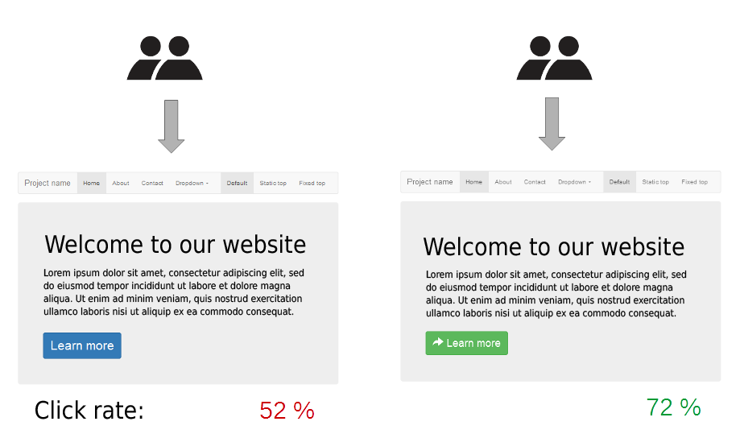

title: TWeb
subtitle: <i class="fas fa-tasks"></i> Testing Javascript Applications
author: Bertil Chapuis
class: animation-fade
layout: true

<!-- This slide will serve as the base layout for all your slides -->

---

class: inverse center middle

# {{title}}

## {{subtitle}}

<p style="margin-top: 40px">{{author}}</p>

---

## <i class="fas fa-tasks"></i> Overview of Today's Class

- Quiz about last week's lecture

- Correction of last week's assignment

- Javascript Arrays and Iterables

- Testing Javascript Applications

- More about Chrome DevTools

- Introduction of next week's assignment

---

class: inverse center middle

#  <i class="fas fa-question-circle"></i> Quiz

---


# <i class="fas  fa-question-circle"></i> Speakup

You can answer to the following Quiz on Speakup.

http://www.speakup.info/

Room Number:  **XXXXX**

Once connected, answer to the first test question.

---

# <i class="fas fa-question-circle"></i> Question 1

Parmis les types suivant, lequels sont primitifs:
- Number
- Object
- Array
- Undefined
- Aucune réponse correcte

---

# <i class="fas fa-question-circle"></i> Question 2

Quelle est la valeur imprimée par le programme suivant?

```js
var obj = {
    "1": 1
}
console.log(obj[1]);
```

- SyntaxError
- 1
- Undefined
- TypeError
- NaN
- Aucune réponse correcte

---

# <i class="fas fa-question-circle"></i> Question 3

Quelle est la valeur imprimée par le programme suivant?

```js
var arr = [];
arr[0] = 0;
arr[2] = 2;
arr[4] = 4;
for (var val in arr) {
    console.log(val)
}
```

- `0 1 2 3 4`
- `0 1 2 3 4 length`
- `0 2 4`
- `0 null 2 null 4`
- `0 undefined 2 undefined 4`
- Aucune réponse correcte

---

# <i class="fas fa-question-circle"></i> Question 4

Que se passe t'il lorsque l'on ajoute une fonction au prototype d'une classe de la librarie standard.

- Cela est interdit
- Les instances futures de la classe hériterons la fonction
- La fonction est copiées instantanément dans toutes les instances existantes de la classe
- Aucune réponse correcte

---

# <i class="fas fa-question-circle"></i> Question 5

Quelle est la valeur imprimée par le programme suivant?

```js
var age = 20;
var student = {
    age: 25
}
function get() {
    return this.student.age;
}
get.prototype.student = {age: 30};
console.log(get());
```

- 20
- 25
- 30
- undefined
- aucune réponse correcte

---

# <i class="fas fa-question-circle"></i> Question 6

Quelle est la valeur imprimée par le programme suivant?

```js
var age = 20;
var student = {
    age: 25,
    get: function() {
        return this.age;
    }
}
var anotherStudent = {
    age: 30,
    get: function() {
        return this.age;
    }
}
console.log(student.get.call(anotherStudent))
```

- 20
- 25
- 30
- undefined
- aucune réponse correcte

---

# <i class="fas fa-question-circle"></i> Question 7

```js
var age = 20;
function Student(age) {
    this.age = age
    return {
        age: 25
    }
}
var student = new Student(30);
console.log(student.age)
```

- 20
- 25
- 30
- undefined
- aucune réponse correcte

---

# <i class="fas fa-question-circle"></i> Question 8

A quoi correspond la propriété `document.referrer`?

- A l'adresse du site Internet visité par l'utilisateur
- A l'adresse du site Internet depuis lequel l'utilisateur est arrivé sur le site
- A l'adresse du site Internet le plus référencé par le site visité par l'utilisateur
- Au référend du site Internet, c'est à dire son propriétaire ou responsable
- Aucune réponse correcte

---

class: inverse center middle

# <i class="far fa-edit"></i> Correction

---

.center[

]

---

class: center middle


# <i class="fas fa-hand-paper"></i> Questions ?

---

class: inverse center middle

# <i class="fab fa-js"></i> Javascript Arrays and Iterables

---

## <i class="fab fa-js"></i> Javascript Arrays .red[*]

Recall the array object, it comes loaded with usefull functional idioms.


`map()` creates a new array with the results of calling a provided function on every element.
```js
var a = ["apple", "banana", "pear"];
a.map(a => a.length)
```


`flatMap()`  maps each element using a mapping function and flatten the result.

```js
var a = ['Yverdon is', 'a', 'beautiful city'];
a.flatMap(s => s.split(" "));
```

`reduce()` executes a reducer function on each element of the array, resulting in a single value.

```js
var a = [1, 2, 3];
a.reduce((a, b) => a + b)
```

Take some time to get familiar with these functions!

.footnote[.red[*] https://developer.mozilla.org/en-US/docs/Web/JavaScript/Reference/Global_Objects/Array]

---

## <i class="fab fa-js"></i> Javascript Iterable .red[*]

Array like objects have been generalized in the javascript language.

Any object can now implement the iterator protocol.

```js
var iterable = {
    i: 10,
    *[Symbol.iterator]() {
        for (var j = 0; j < this.i; j++) {
            yield j;
        }
    }
}
for (let k of iterable) {
    console.log(k);
}
```

.footnote[.red[*] https://developer.mozilla.org/en-US/docs/Web/JavaScript/Guide/Iterators_and_Generators]

---

## <i class="fab fa-js"></i> Javascript Generator .red[*]

Array like objects have been generalized in the javascript language.

Generators can be used to `yield` values (or `yield*` iterables).

```js
function* generator(i) {
  for (var j = 0; j < i; j++) {
      yield j;
  }
}
for (let k of generator(10)) {
    console.log(k);
}
```

.footnote[.red[*] https://developer.mozilla.org/en-US/docs/Web/JavaScript/Guide/Iterators_and_Generators]


---

## <i class="fab fa-js"></i> Usefull Built-in Iterables .red[*] 


The `Map` object holds key-value pairs and remembers the original insertion order of the keys.

The `Set` object lets you store unique values of any type, whether primitive values or object references.


.footnote[.red[*] https://developer.mozilla.org/en-US/docs/Web/JavaScript/Reference/Global_Objects]


---

class: inverse center middle

# <i class="fab fa-js"></i> Testing Javascript Applications 
---

## <i class="fab fa-js"></i> A Bit of Philosophy


.center[


The whole is greater than the sum of its parts. - **Aristotle**
]

---

## <i class="fas fa-check-square"></i> Testing Software 

### Unit Testing

Test individual units of source code in an isolated fashion to determine whether they are correct (fit for use).

### Fuzz Testing

Automated software technique that monitors a program for exceptions when inputing random data.

### Integration Tests

Test several units of source code combined together to determine if they work correctly as a group.

### Functional Tests

Test the software without making assumptions about its internal workings (as a black box).


---


## <i class="fas fa-check-square"></i> Usability Testing

A/B testing, split testing and multivariate testing evaluate a software by testing one or more hypothesis on its users. 

.center[

]

.footnote[.red[*] https://marketingplatform.google.com/about/optimize/]

---


## <i class="fas fa-check-square"></i> Continuous Integration, Delivery, Deployment .red[*]

.center[

]

.footnote[.red[*] https://www.atlassian.com/continuous-delivery/principles/continuous-integration-vs-delivery-vs-deployment]

---

## <i class="fas fa-check-square"></i> Chaos Engineering .red[*]

Chaos Engineering is the discipline of experimenting on a system
in order to build confidence in the system’s capability
to withstand turbulent conditions in production.

# Netflix's ChaosMonkey

**Chaos Monkey** is responsible for randomly terminating instances in production to ensure that engineers implement their services to be resilient to instance failures.

.footnote[.red[*] http://principlesofchaos.org/]

---

## <i class="fas fa-check-square"></i> Site Reliability Engineering (SRE) .red[*]

Site Reliability Engineering (SRE) is a discipline that incorporates aspects of software engineering and applies them to infrastructure and operations problems.

The main goals are to create scalable and highly reliable software systems.

SRE is what happens when you ask a software engineer to design an operations team. - **Ben Treynor**

.footnote[.red[*] https://landing.google.com/sre/sre-book/chapters/introduction/]

---

## <i class="fas fa-hand-paper"></i> Testing Javascript Applications .red[*]

### Libraries

- [Mocha](https://mochajs.org/) is a feature-rich JavaScript test framework running on Node.js and in the browser, making asynchronous testing simple and fun.

- [Chai](https://www.chaijs.com/) is an assertion library for node and the browser that can be delightfully paired with any javascript testing framework.

- [Selenium](https://www.seleniumhq.org/) automates web applications for testing purposes.

- [Selenium Webdriver](https://www.npmjs.com/package/selenium-webdriver) is a nodejs programming interface for web browsers.

### Hands on!

Let's play with a simple [example](https://github.com/tweb-classroom/example-testing)!
