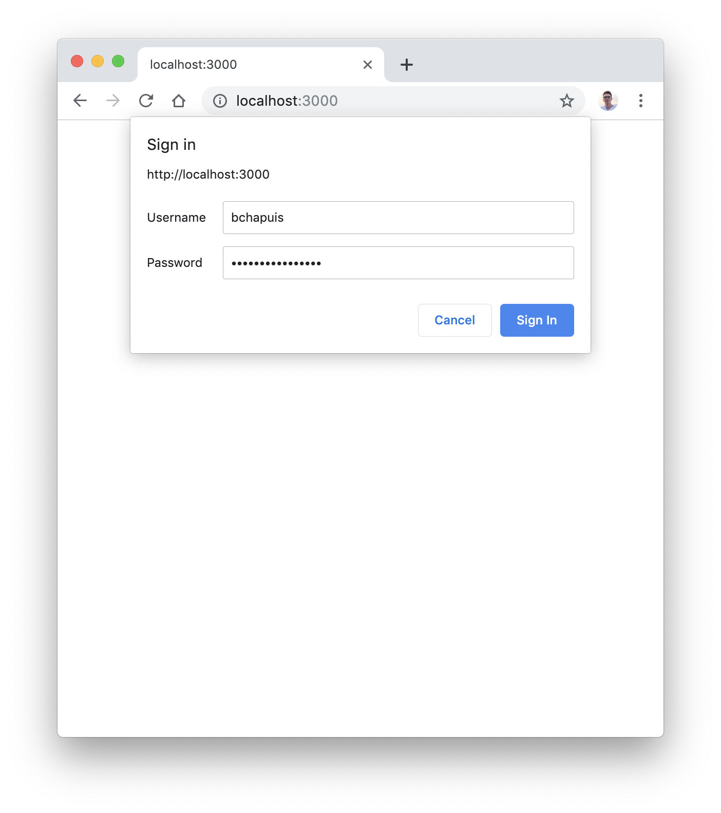
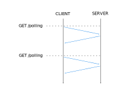
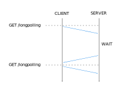
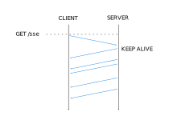
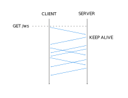

title: TWeb
subtitle: <i class="fab fa-js"></i> Full Duplex Web Applications
author: Bertil Chapuis
class: animation-fade
layout: true

<!-- This slide will serve as the base layout for all your slides -->

---

class: inverse center middle

# {{title}}

## {{subtitle}}

<p style="margin-top: 40px">{{author}}</p>

---

## <i class="fas fa-tasks"></i> Overview of Today's Class

- Quiz about last week's lecture

- Correction of last week's assignment

- Full duplex web applications

- Introduction of next week's assignment

- Preparation to next week's evaluation

---

class: inverse center middle

#  <i class="fas fa-question-circle"></i> Quiz

---

# <i class="fas  fa-question-circle"></i> Speakup

You can answer to the following Quiz on Speakup.

http://www.speakup.info/

Room Number:  **XXXXX**

Once connected, answer to the first test question.

---

# <i class="fas fa-question-circle"></i> Question 1

Quelle est la valeur de l'objet JavaScript retournée par le programme suivant?

```js
var json = '["a", "b", {"c": 1}, ["d", "2"]]';
console.log(JSON.parse(json));
```

- Uncaught SyntaxError: Unexpected token a in JSON at position 1
- `{"a", "b", {c: 1}, ["d", "2"]}`
- ***`["a", "b", {c: 1}, ["d", "2"]]`***
- Aucune réponse correcte

---

# <i class="fas fa-question-circle"></i> Question 2

Quelle est la valeur retournée par le programme suivant?

```js
var json = {a: "a", "b": "b"};
console.log(JSON.stringify(json));
```

- `{a:"a","b":"b"}`
- ***`{"a":"a","b":"b"}`***
- Uncaught SyntaxError: Unexpected token a in JSON at position 1
- Aucune réponse correcte

---

# <i class="fas fa-question-circle"></i> Question 3

Quelles sont les affirmation correctes à propos de la programmation asynchrone?

- ***Une instruction asynchrone est non-bloquante***
- Une instruction asynchrone est bloquante
- ***Les instructions asynchrones sont executée dans la boucle d'évènements (Event Loop)***
- La programation asynchrone est toujours basée sur les callbacks
- Aucune réponse correcte

---

# <i class="fas fa-question-circle"></i> Question 4

Quelle est la valeur affichée par le programme suivant?

```js
var value = 1;
var promise = Promise.resolve(2).then(v => value = v).catch(e => value = 3);
console.log(value);
```

- `1`
- `2`
- `3`
- ***`1` ou `2`*** (Non déterministe à cause de l'event loop)
- `1` ou `3`
- Aucune réponse correcte

---

# <i class="fas fa-question-circle"></i> Question 5

Quelle est la valeur affichée par le programme suivant?

```html
<script>
  async function f() {
    return 1;
  }
  var v = await f();
  console.log(v);
</script>
```

- `1`
- une promesse
- ***Uncaught SyntaxError: await is only valid in async function***
- Aucune réponse correcte

---

# <i class="fas fa-question-circle"></i> Question 6

Quelle est mot clé décrit le mieux l'état de la promesse suivante après 10 secondes?

```js
var promise = new Promise(function(resolve, reject) {
  setTimeout(function() {
    if (Math.random() > 0.5) {
        resolve(42); 
    } else {
        reject("The ultimate question to life, the universe and everything has no answer!")
    } 
  }, 1000);
});
```

- pending
- resolved
- ***settled***
- rejected
- Aucune réponse correcte

---

class: center middle


# <i class="fas fa-hand-paper"></i> Questions ?

---

class: inverse center middle

# <i class="far fa-edit"></i> Correction

---

.center[

]

---

class: center middle

# <i class="fas fa-hand-paper"></i> Questions ?

---

class: inverse center middle

#  <i class="fab fa-js"></i> Full Duplex Web Applications

---

## <i class="fab fa-js"></i> HTTP .red[*]

Recall that the Hypertext Transfer Protocol (HTTP) is a request/response protocol.

**HTTP/1.0** had a **short-lived** connection model and allowed **persistent connection** with the `Connection: keep-alive` HTTP header.

**HTTP/1.1**, the version of HTTP commonly used by Web browsers, introduced:

- **Persistent connections** that allow to reuse a TCP connection to send and receive multiple requests and responses (modern browsers **enable** this by default);

- **Pipelined connections** that allow to send multiple requests without waiting for the corresponding responses (modern browsers **do not enable** this by default);

- **Chunked transfers** that allow to divide the data stream into a series of chunks that are received independently of each other;

- **Protocol upgrades** that allow a clietn to ask the server for a change in the application protocol.

.footnote[.red[*] https://www.ietf.org/rfc/rfc2616.txt]

---

## <i class="fab fa-js"></i> HTTP Connection management .red[*]

.center[

]

.footnote[.red[*] https://en.wikipedia.org/wiki/HTTP_persistent_connection]

---

## <i class="fas fa-hand-paper"></i> Implementing a Chat Application

Clone the `example-chat` repository in the `tweb-classroom` organization.

The following slides will be illustrated with these examples.

---

## <i class="fab fa-js"></i> Polling

- The browser **polls** events at a fixed interval
- The server returns an empty result if events are unavailable and close the connection
- The function `setInterval` is typically used set the interval
- **Limitation:** the interval introduce a delay



---

## <i class="fab fa-js"></i> Long-Polling

- The browser **polls** events and keeps the connection open
- The server returns events once they are available and closes the connection
- When receiving events the browsers **polls** events again
- **Limitation:** this method requires to perform several requests




---

## <i class="fab fa-js"></i> Server-side Events (SSE) .red[*]

- The browser **listen** to events and keeps the connection open
- The server returns events as they become available and keeps the connection open
- The browser provides the **EventStream API** that manages reconnections
- **Limitation:** this method allows to communicate from the client to the server only



.footnote[.red[*] https://developer.mozilla.org/en-US/docs/Web/API/Server-sent_events/Using_server-sent_events]

---

## <i class="fab fa-js"></i> Websocket .red[*]

- The browser open a connection and `Upgrade` the protocol to websocket
- Once the websocket connection is open the browser and the server are allowed to send events
- The browser provides the **WebSocket API** that manages protocol upgrade
- **Limitation:** this method is characterized by a relatively high latency (TCP)



.footnote[.red[*] https://developer.mozilla.org/en-US/docs/Web/API/WebSocket#Examples]

---

class: center middle

# <i class="fas fa-hand-paper"></i> Questions ?

---

class: inverse center middle

# <i class="fa fa-tasks"></i> Assignment

---

.center[

]

---

class: center middle

# <i class="fas fa-hand-paper"></i> Questions ?

