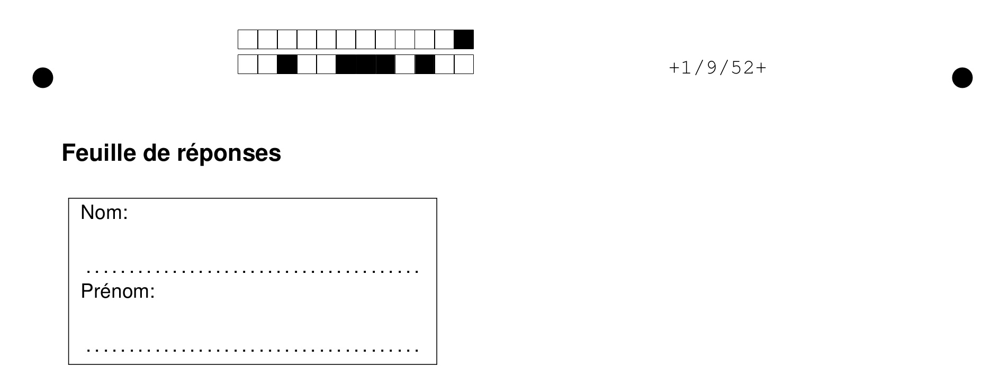
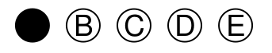
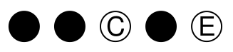
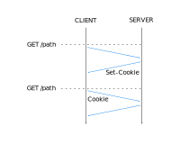

title: TWeb
subtitle: <i class="fas fa-cookie-bite"></i> Cookies
author: Bertil Chapuis
class: animation-fade
layout: true

<!-- This slide will serve as the base layout for all your slides -->

---

class: inverse center middle

# {{title}}

## {{subtitle}}

<p style="margin-top: 40px">{{author}}</p>

---

## <i class="fas fa-tasks"></i> Overview of Today's Class

- Evaluation

- Cookies and Sessions

- Projects

---

class: inverse center middle

#  <i class="fas fa-check-square"></i> Evaluation

---


# <i class="fas fa-check-square"></i> Instructions Générales

- Durée: 1h

- Aucune documentation autorisée

- Ne répondez que sur la feuille de réponses! Aucune autre réponse ne sera prise en compte.

- Les questions sans ♣ ont une bonne réponse.

- Les questions avec ♣ ont une ou plusieurs bonnes réponses.

- Vous rendrez cet énoncé et la feuille de réponses.

- Les deux documents doivent porter votre nom et prénom.


---

# <i class="fas fa-check-square"></i> Grille de Réponses

Un logiciel de QCM est utilisé pour les évaluations:




Remplissez les cases de réponse de la manière suivante (une bonne réponse):



Ou de la manière suivante (plusieurs bonnes réponses):



---

# <i class="fas fa-check-square"></i> Grille de Réponses

- Coloriez complètement et proprement chaque case choisie

- Utilisez du noir ou du bleu foncé 

- Ne coloriez pas les cases au crayon et n’utilisez pas de couleur rouge

- Utilisez si possible un Tipp-Ex pour corriger une éventuelle erreur

---

class: center middle

# Bon travail!

---


class: inverse center middle

#  <i class="fas fa-cookie-bite"></i> Cookies and Sessions

---

## <i class="fas fa-cookie-bite"></i> Cookies .red[*]

A cookie is a small piece of data that a server sends to the user's web browser. 

The browser may store it and send it back with the next request to the same server.

Cookies are mainly used for three purposes:

- Session management

- Personalization

- Tracking

Cookies remember stateful information for the stateless HTTP protocol. 

They are sent with every request and can worsen performance.

.footnote[.red[*] https://developer.mozilla.org/en-US/docs/Web/HTTP/Cookies]


---

## <i class="fas fa-cookie-bite"></i> HTTP Headers .red[*]





The Set-Cookie HTTP response header sends cookies from the server to the user agent.

```http
Set-Cookie: <cookie-name>=<cookie-value>; <cookie-name>=<cookie-value>
```

The browser will send back all previously stored cookies to the server using the Cookie header.

```http
Cookie: <cookie-name>=<cookie-value>; <cookie-name>=<cookie-value>
```

---

## <i class="fas fa-cookie-bite"></i> HTTP Headers .red[*]

A cookie without `Expires` is called a session cookie, i.e., it is deleted when the client shuts down.

```http
Set-Cookie: cookie=choco
```

A cookie with `Expire` set to a date or to `Max-Age` will survive the session.

```http
Set-Cookie: cookie=choco; Expires=Wed, 21 Oct 2020 07:28:00 GMT;
```


The cookie can be made inaccessible to JavaScript with the `HttpOnly` directive.

```http
Set-Cookie: cookie=choco; HttpOnly
```

It is also possible to require the HTTPS protocol for transmitting cookies with the `Secure` directive.

```http
Set-Cookie: cookie=choco; Secure
```

.footnote[.red[*] https://developer.mozilla.org/en-US/docs/Web/HTTP/Cookies]

---

## <i class="fas fa-cookie-bite"></i> Setting Cookies from the Client .red[*]

It is possible to access the cookie from the same origin with javascript.

```js
var cookie = document.cookie;
```

Similarly, the value of the cookie can be modified from JavaScript.

```js
document.cookie = "another_cookie=more_choco";
```

.footnote[.red[*] https://developer.mozilla.org/en-US/docs/Web/API/Document/cookie]

---

## <i class="fas fa-hand-paper"></i> Cross-site Request Forgery (CSRF) .red[*]

CSRF is an attack that impersonates a trusted user and sends a website unwanted commands. 

Clone the `example-cookie` repository in the `tweb-classroom` organization.

It illustrates how easily this kind of attack can be achieved.

.footnote[.red[*] https://developer.mozilla.org/en-US/docs/Glossary/CSRF]

---

class: center middle

# <i class="fas fa-hand-paper"></i> Questions ?

---

class: inverse center middle

# <i class="fa fa-tasks"></i> Project

---

# <i class="fa fa-tasks"></i> Project

Implémenter et documenter **deux améliorations significatives** au jeu vidéo.

Exemples: 
- Faire le rendu du jeu avec WebGL avec [threejs](https://threejs.org/)
- Communiquer en P2P avec WebRTC avec [peerjs](https://peerjs.com/)
- Créer une plateforme de gestion des parties
- Sécuriser l'ensemble de l'application
- Changer le gameplay
- Implémenter une IA

Les améliorations doivent être décrites et validées dans un délai de deux semaines.

### Soyez créatifs... ;)

---

class: center middle

# <i class="fas fa-hand-paper"></i> Questions ?

