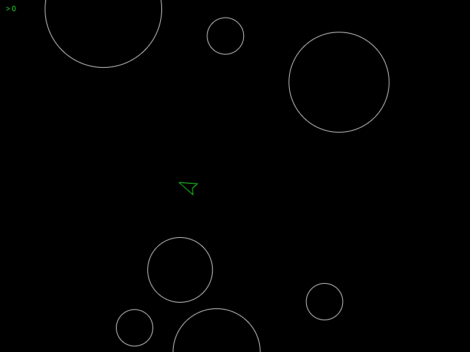

title: TWeb
subtitle: <i class="fas fa-sign-in-alt"></i> Authentication and Authorization
author: Bertil Chapuis
class: animation-fade
layout: true

<!-- This slide will serve as the base layout for all your slides -->

---

class: inverse center middle

# {{title}}

## {{subtitle}}

{{author}}

---

## <i class="fas fa-tasks"></i> Overview of Today's Class

- Quiz about last week's lecture

- Correction of last week's assignment

- Authentication and Authorization

---

class: inverse center middle

#  <i class="fas fa-question-circle"></i> Quiz

---

# <i class="fas  fa-question-circle"></i> Speakup

You can answer to the following Quiz on Speakup.

http://www.speakup.info/

Room Number:  **XXXXX**

Once connected, answer to the first test question.

---

# <i class="fas fa-question-circle"></i> Question 1

Parmis les architectures suivantes, la ou lesquelles permettent une communication bi-directionnelle?

- Polling

- Long-Polling

- Server-Sent Events

- **WebSocket**

- Aucune réponse correcte

---

# <i class="fas fa-question-circle"></i> Question 2

Cochez les affirmations correctes à propos de l'API EventStream (SSE).

- **Lorsque le serveur ferme la connexion, le navigateur essaie de se reconnecter automatiquement.**

- Lorsque le navigateur ferme la connexion, le serveur essaie de se reconnecter automatiquement.

- **Un mechanisme de callback permet d'observer l'état de la connexion ('open', 'close').**

- **Le navigateur transmet les message au serveur à l'aide du 'Chunked transfer encoding'.**

- Aucune affirmation correcte

---

# <i class="fas fa-question-circle"></i> Question 3

Vous souhaitez implémenter une stratégie de type Long-Polling pour communiquer avec un serveur (`www.example.com`). Parmis les programmes suivant, lequel implémente cette stratégie?

- `var conn = new WebSocket("http://www.example.com");`

- `var conn = new EventStream("http://www.example.com");`

- `setInterval(function () { fetch("http://www.example.com").then(doSomething) }, 1000);`

- **`function get() {fetch("http://www.example.com").then(() => { doSomething(); get(); })};`**

---

# <i class="fas fa-question-circle"></i> Question 4

Quel header HTTP permet à un serveur d'initializer un cookie dans le navigateur?

- **`Set-Cookie`**

- `Cookie`

- `Secure-Cookie`

- `HttpOnly`

- `document.cookie`

- Aucune affirmation correcte

---

class: center middle

# <i class="fas fa-hand-paper"></i> Questions ?

---

class: inverse center middle

# <i class="far fa-edit"></i> Correction

---

.center[

]

---

class: center middle

# <i class="fas fa-hand-paper"></i> Questions ?

---

class: inverse center middle

#  <i class="fas fa-sign-in-alt"></i> Authentication and Authorization

---

# <i class="fas fa-sign-in-alt"></i>Authentication and Authorization .red[*]

In a web application, **authentication** verifies the credentials (login information).  **Authorization** typically verifies the right to view, create, edit, or delete some content.

- **Authentication** asserts that someone is who he claim to be.

- **Authorization** asserts that someone has the right to perform a given action.

.footnote[.red[*] source]

---

# <i class="fas fa-sign-in-alt"></i>Authentication Mechanisms

The Web provides a plethora of authentication method:

- Cookie and Session
- `Authentication` Header
    - HTTP basic
    - HMAC token
    - JWT token
    - Bearer token
- `X-API-Key` Header
- [OAuth2](https://oauth.net/2/)
- [WebAuthN](https://webauthn.io/)
- etc.

---

# <i class="fas fa-sign-in-alt"></i> One size does not fit all!

The choice of an authentication method typically varies depending on:

- The kind of entity you authenticate (Human or Machine)
- The kind of service you provide (API or Webapp)
- The kind of web application you devise (SPA or MPA)
- The needs in terms of security (immediate revokation, time-to-live, etc.)
- etc.

---

# <i class="fas fa-sign-in-alt"></i>Authorization Mechanisms

In Web applications, authorization mechanisms often rely on the notions of:

- Roles (admin, editor, user)

- Ownership (does this resource, object or attribute belong to that user)

In Web applications, authorization mechanisms are often implemented by hand, which gives a lot of flexibility.

Plugins, such as [express-acl](https://www.npmjs.com/package/express-acl) or [express-rbac](https://www.npmjs.com/package/express-rbac), implement popular authorization strategies, such as **access control list (ACL)** or **role based access control (RBAC)**.

---

# <i class="fas fa-hand-paper"></i> Learn more about JSON Web Token (JWT) ?

Learn more about JWT:

https://jwt.io/

Try to answer the following questions:
- Can JWT be used for Authentication?
- Can JWT be used for Authorization?
- Why is JWT often refered to as a scalable method?
- Can a JWT token be easily revoked?
- Would you use JWT tokens for authenticating computers that perform API calls?  

---

# <i class="fas fa-hand-paper"></i> Learn more about OAuth2 ?

Learn more about OAuth2 on:

https://auth0.com/docs/api-auth/which-oauth-flow-to-use

Try to answer the following questions:
- What kind of Access Token does OAuth2 use?
- Why does OAuth2 introduced the notion of Flow?
- Can OAuth2 be used to authenticate the users of an MPA?
- Can OAuth2 be used to authenticate the users of an SPA?

---

# <i class="fas fa-hand-paper"></i> Configure an Authentication Middleware in Express

Clone the `example-passport` repository from the `tweb-classroom` organization.

It illustrates how:
- Local authentication can be configured in express with [Passport](http://www.passportjs.org/)
- Github can be used for authentication (via oauth2)
- An attacker can impersonate users with CSRF
- A website can be protected from CSRF attacks

---

class: center middle

# <i class="fas fa-hand-paper"></i> Questions ?

