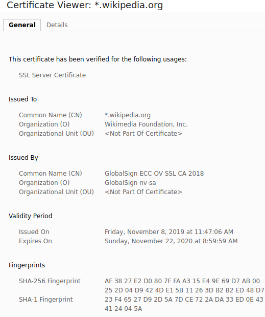
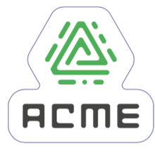

title: TWeb
subtitle: <i class="fab fa-js"></i> CORS, XSS and HTTPS
author: Bertil Chapuis
class: animation-fade
layout: true

<!-- This slide will serve as the base layout for all your slides -->

---

class: inverse center middle

# {{title}}

## {{subtitle}}

<p style="margin-top: 40px">{{author}}</p>

---

## <i class="fas fa-tasks"></i> Overview of Today's Class

- Quiz about last week's lecture

- CORS

- XSS

- HTTPS

---

class: inverse center middle

#  <i class="fas fa-question-circle"></i> Quiz

---

# <i class="fas  fa-question-circle"></i> Speakup

You can answer to the following Quiz on Speakup.

http://www.speakup.info/

Room Number:  **XXXXX**

Once connected, answer to the first test question.

---

# <i class="fas fa-question-circle"></i> Question 1

Cochez les affirmations correctes à propos des méchanismes d'autorisation (Authorization):

- Les méchanismes d'authorisation concernent l'identification d'un utilisateur
- Les méchanismes d'authorisation concernent les règles d'accès à un contenu ou à une resource
- OAuth2 est un méchanisme d'autorisation
- Les méchanismes d'authorisation concernent l'identification d'un navigateur
- Les méchanismes d'authorisation impliquent les notions de roles et de propriété
- Un token JWT peut être utiliser pour implémenter un méchanisme d'autorisation
- Aucune réponse correcte

---

# <i class="fas fa-question-circle"></i> Question 2

Cochez les affirmations correctes à propos de CSRF:

- CSRF signifie Cross-Site Request Felony
- Lors d'une attaque CSRF, l'attaquant injecte un code malicieux sur le site visité par la victime
- Lors d'une attaque CSRF, l'attaquant se fait passer pour l'utilisateur en l'ammenant à exécuter une requête non désirée sur le site visé
- Lors d'une attaque CSRF, l'attaquant se fait passer pour l'utilisateur en gagnant l'accès à son token d'authenfication
- On se protège d'une attaque CSRF en ajoutant des token sur les pages web
- On se protège d'une attaque CSRF en configurant correctement OAuth2
- Aucune réponse correcte

---

class: center middle


# <i class="fas fa-hand-paper"></i> Questions ?

---

class: inverse center middle

#  <i class="fas fa-sitemap"></i> CORS

---

#  <i class="fas fa-sitemap"></i> Same-origin policy .red[*]

The same-origin policy is a critical security mechanism that restricts how a document or script loaded from one origin can interact with a resource from another origin. 

Two URLs have the same origin if the domain, protocol and port are the same for both.


.footnote[.red[*] https://developer.mozilla.org/en-US/docs/Web/Security/Same-origin_policy]


---

#  <i class="fas fa-sitemap"></i> Cross-Origin Resource Sharing (CORS) .red[*]

A web application executes a cross-origin HTTP request when it requests a resource that has a different origin (domain, protocol, or port) from its own.


.footnote[.red[*] https://developer.mozilla.org/en-US/docs/Web/HTTP/CORS]

---

#  <i class="fas fa-sitemap"></i> Cross-Origin Resource Sharing (CORS) .red[*]


CORS uses HTTP headers to give a web application running at one origin, access to selected resources from a different origin. 

In a request from `domain-a.com` the `Origin` header tells `domain-b.com` where the request come from.

```http
GET / HTTP/1.1
Host: domain-b.com
Origin: http://domain-a.com
```

In a response from `domain-b.com`, the `Access-Control-Allow-Origin` header tells the browser if it is allowed to include the resource.
Here, the `*` wildcard means that the resource can be accessed by any domain.

```http
HTTP/1.1 200 OK
Access-Control-Allow-Origin: *
```

The `domain-b.com` server can restrict access to `domain-a.com` as follow: 

```http
HTTP/1.1 200 OK
Access-Control-Allow-Origin: http://domain-a.com
```

.footnote[.red[*] https://developer.mozilla.org/en-US/docs/Web/HTTP/CORS]


---

#  <i class="fas fa-sitemap"></i> Advanced CORS requests

## Credentialed request

**Credentialed requests** are aware of **third-party** HTTP cookies and HTTP information that are not sent by default in cross-site requests.

```js
fetch(url, {method: 'POST', credentials: 'include', body: JSON.stringify(data)});
```

https://developer.mozilla.org/en-US/docs/Web/HTTP/CORS#Requests_with_credentials


## Preflight request

A CORS **preflight request** is an OPTIONS request that is automatically issued by the browser to checks wether the server is aware of the methods and headers being used by the client (e.g. `Access-Control-Request-Method: DELETE`).
If the server allows this kind of requests, then it answers with the corresponding header (e.g. `Access-Control-Allow-Methods: DELETE`), allowing the browser to send the actual request (e.g. `DELETE`).

https://developer.mozilla.org/en-US/docs/Glossary/Preflight_request


---

#  <i class="fas fa-hand-paper"></i> Hands on CORS

Clone the `example-cors` repository located in the `tweb-classroom` organization.

It illustrates how to properly configure CORS when cross-origin requests are needed.

---

class: center middle

# <i class="fas fa-hand-paper"></i> Questions ?

---

class: inverse center middle

#  <i class="fas fa-user-secret"></i> XSS

---

#  <i class="fas fa-user-secret"></i> Cross-site scripting (XSS) .red[*]

Cross-site scripting (XSS) is a security exploit which allows an attacker to inject into a website malicious client-side code. 
This code is executed by the victims and lets the attackers bypass access controls and impersonate users.

.footnote[.red[*] https://developer.mozilla.org/en-US/docs/Glossary/Cross-site_scripting]

---

# <i class="fas fa-user-secret"></i> Preventing XSS with HTML sanitization .red[*]

An HTML sanitization library strips anything that could lead to script execution from HTML, so you can safely inject complete sets of HTML nodes from a remote source into your DOM.

Recall that Javascript can be included with the script element:

```html
<scriptt>
alert('Hello World!');
</scriptt>
```

But also with HTML attributes:

```html
<a onclick="alert('Hello World!')">link</a>
```

Hence, the necessity to carefully check the HTML before saving or displaying it.

.footnote[.red[*] https://developer.mozilla.org/en-US/docs/Mozilla/Add-ons/WebExtensions/Safely_inserting_external_content_into_a_page#Working_with_HTML_content]


---


# <i class="fas fa-user-secret"></i> Preventing XSS with Content Security Policy (CSP) .red[*]

CSP enables the server to specify trusted domains, which enables the mitigation of XSS attacks.

For instance, the following policy trust subresource from the current domain and images from instagram:

```http
Content-Security-Policy: default-src 'self'; img-src instagram.com
```

A CSP compatible browser will then only execute scripts loaded in source files received from those allowlisted domains

Therefore, such a policy will prevent the transmission of user credentials to a untrusted server.


.footnote[.red[*] https://developer.mozilla.org/en-US/docs/Web/HTTP/CSP]

---

#  <i class="fas fa-hand-paper"></i> Hands on XSS

Clone the `example-xss` repository located in the `tweb-classroom` organization.

It illustrates the threats associated with cross-site scripting and how to mitigate them.

---

class: center middle

# <i class="fas fa-hand-paper"></i> Questions ?

---

class: inverse center middle

# <i class="fas fa-lock"></i> HTTPS

---


# <i class="fas fa-network-wired"></i> Internet's Conceptual Model

.center[

]

Providing encryption at the level of the transport layer (SSL/TLS) makes communication security transparent to the application developers (e.g. HTTP becomes HTTPS).

---

# <i class="fas fa-lock"></i> SSL/TLS

- Operates on top of the transport protocol (TCP)

- Implements a socket interface

- Provides:
  - **Confidentiality** of the data
  - **Integrity** of the data
  - **Authentication** of the server

- Relies on a handshake protocol based on digital (cryptographic) certificates to generate session key

---

# <i class="fas fa-lock"></i> Digital certificates

.column.center[
    

]

.column[

- Bound to a <i class="fas fa-globe"></i> hostname

- Contain a <i class="fas fa-key"></i> public key

- Contain a proof that the owner of the hostname holds the private key

- Valid for a certain <i class="far fa-calendar-times"></i> period

- Issued and <i class="fas fa-signature"></i> signed by a <i class="fas fa-building"></i> certification authority (CA)

  - Operating systems and Web browsers are shipped with a list of trusted CA certificates

- Etc.
]

---

# <i class="fas fa-lock"></i> SSL/TLS

Overall, SSL/TLS operates as follow:

- The clients connects to the server and describes its capabilities (i.e., the ciphers it supports) and a random number

- The server chooses a cipher (e.g., TLS_RSA_WITH_3DES_EDE_CBC_SHA) and sends back its choice of cipher, its certificate and a random number

- The client checks the certificate.

- Both derive a session key from the two random numbers and exchange the hashes of the initial handshake messages

## <i class="fas fa-hand-paper"></i> Going further...

[The illustrated TLS Connection](https://tls.ulfheim.net/)

---

# <i class="fas fa-lock"></i> Let's Encrypt and ACME


**Let's Encrypt** is a non-profit certificate authority run by Internet Security Research Group that provides X.509 certificates for Transport Layer Security encryption at no charge. 




The **Automatic Certificate Management Environment (ACME)** protocol is a communications protocol for automating interactions between certificate authorities and their users' web servers, allowing the automated deployment of public key infrastructure at very low cost. It was designed by the Internet Security Research Group (ISRG) for their Let's Encrypt service.

---

# <i class="fas fa-hand-paper"></i> Developing with certificates?

mkcert is a simple tool for making locally-trusted development certificates. It requires no configuration.

It creates and installs a local CA in the system root store, and generates locally-trusted certificates.

https://github.com/FiloSottile/mkcert

---

class: center middle

# <i class="fas fa-hand-paper"></i> Questions ?
