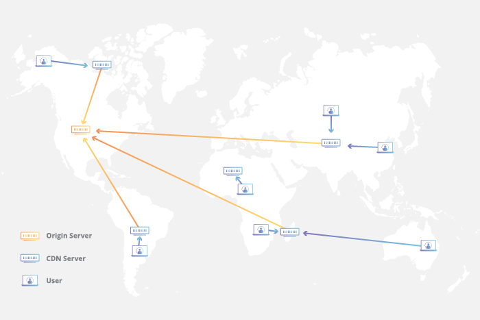

title: TWeb
subtitle: <i class="fab fa-js"></i> REST Architecture
author: Bertil Chapuis
class: animation-fade
layout: true

<!-- This slide will serve as the base layout for all your slides -->

---

class: inverse center middle

# {{title}}

## {{subtitle}}

<p style="margin-top: 40px">{{author}}</p>

---

## <i class="fas fa-tasks"></i> Overview of Today's Class

- Questionnaire d'évaluation GAPS

- Quiz about last week's lecture

- REST Architecture

---

class: inverse center middle

#  <i class="fas fa-question-circle"></i> Quiz

---

# <i class="fas  fa-question-circle"></i> Speakup

You can answer to the following Quiz on Speakup.

http://www.speakup.info/

Room Number:  **XXXXX**

Once connected, answer to the first test question.

---


# <i class="fas fa-question-circle"></i> Question 1

Que se passe-t-il lorsqu'une requête `Fetch` effectuée par le navigateur depuis l'origine `http://domain-a.com` sur l'origine `http://domain-b.com` resulte en la réponse HTTP suivante:

```http
HTTP/1.1 200 OK
Access-Control-Allow-Origin: http://domain-b.com
```

- Le navigateur peut accèder au contenu de la réponse
- Le serveur stoppe l'envoi de la réponse
- Le navigateur envoie une requête preflight au serveur
- Le navigateur envoie une requête au serveur en spécifiant `Access-Control-Allow-Origin: *`
- Le navigateur ne peut pas accèder au contenu de la réponse


---

# <i class="fas fa-question-circle"></i> Question 2

La pull request suivante ne casse pas les builds et passe tous les tests unitaires.
Que faite vous? Quelles corrections demandez-vous?

```js
app.get('/directory', function (req, res) {
  var query = req.query.query;
  var names = database.query(`SELECT name FROM person WHERE name LIKE '%${query}%'`);
  res.send(`<h1>${query}</h1>` + names.map(name => `<p>${name}</p>`).join(""));
});
```

---

# <i class="fas fa-question-circle"></i> Question 3

Cochez les affirmations correctes à propos des attaques XSS:
- XSS implique l'injection d'un script sur le site visé
- XSS implique un site tiers qui exécute une requête sur le site visé
- XSS implique l'envoi d'emails aux utilisateur visés
- On se protège de XSS en ajoutant des tokens dans les pages web
- On se protège de XSS en configurant correctement CSP
- On se protège de XSS en sanitizant les données utilisateur

---

# <i class="fas fa-question-circle"></i> Question 4

Cochez les affirmations correctes à propos des autorités de certifications:
- A chaque démarrage le navigateur met à jour la liste des certificats CA
- Un certificat CA est valide tant que la clé privée du site Internet n'est pas compromise
- Une liste de certificats CA est stockée installée avec le système d'exploitation
- Un certificat self-signed peut-être utilisé pour prouver la propriété d'un nom de domaine
- Un certificat self-signed peut-être utilisé pour encrypter des communications

---

class: center middle


# <i class="fas fa-hand-paper"></i> Questions ?

---

class: inverse center middle

#  <i class="fas fa-bed"></i> REST Architecture

---

## <i class="fas fa-bed"></i> What is a Restful API?

**API** stands for application programming interface.

An API is an interface or communication protocol between different parts of a computer program.

A Restful API, is an API that follows the constraints defined by REST.

---

## <i class="fas fa-bed"></i> What does REST mean? .red[*]

**REST** stands for representational state transfer.

It is a software architectural style that defines a set of constraints:

- Client-server
- **Uniform Interface**
- **Stateless**
- **Cache**
- **Layered System**
- Code-On-Demand (Optional)

These constraints fit well with HTTP, but can apply to different protocols as well.

.footnote[.red[*] https://www.ics.uci.edu/~fielding/pubs/dissertation/rest_arch_style.htm]

---

## <i class="fas fa-bed"></i> Uniform Interface .red[*]

By applying the software engineering principle of generality to the component interface, the overall system architecture is simplified and the visibility of interactions is improved.

The architectural constraints of a uniform interface are: 

  - Identification of resources (URI)

  - Manipulation of resources (GET, POST, PUT, DELETE, PATCH, HEAD)

  - Self-descriptive messages (Content-Type: application/json)

  - Hypermedia as the engine of application state (HATEOAS)

.footnote[.red[*] https://www.ics.uci.edu/~fielding/pubs/dissertation/rest_arch_style.htm]

---

## <i class="fas fa-hand-paper"></i> Uniform Interface

In the following example, identify the architectural constrains of the uniform interface.

```http
GET https://api.github.com/users/royfielding
```

```http
HTTP/1.1 200 OK
Content-Type: application/json; charset=utf-8
{
  "name": "Roy T. Fielding",
  "company": "Adobe",
  "blog": "http://roy.gbiv.com/",
  "location": "Tustin, California",
  "login": "royfielding",
  "id": 1724757,
  ...
  "following_url": "https://api.github.com/users/royfielding/following{/other_user}",
  "gists_url": "https://api.github.com/users/royfielding/gists{/gist_id}",
  "starred_url": "https://api.github.com/users/royfielding/starred{/owner}{/repo}",
}
```

---

## <i class="fas fa-bed"></i> Stateless Constraint .red[*]

Communication must be **stateless** in nature, such that each **request** from client to server must **contain all of the information necessary to understand the request**, and cannot take advantage of any stored context on the server. 

This constraint induces the properties of:

- **Visibility** is improved because a monitoring system does not have to look beyond a single request datum in order to determine the full nature of the request.

- **Reliability** is improved because it eases the task of recovering from partial failures.

- **Scalability** is improved because not having to store state between requests allows the server component to quickly free resources, and further simplifies implementation because the server doesn't have to manage resource usage across requests.

A **RESTful** architecture imposes that **Session state** is kept entirely on the **client**.

.footnote[.red[*] https://www.ics.uci.edu/~fielding/pubs/dissertation/rest_arch_style.htm]

---

## <i class="fas fa-bed"></i> Statelessness in the Wild .red[*]

If the **session state** is kept entirely on the **client** and embed in **requests**, then **any server** behind a reverse proxy can compute responses.


The **serverless model**, which often refer to server-side computations that run in **stateless** compute containers, extensively rely on the **stateless** constraint.


---

## <i class="fas fa-bed"></i> Cache Constraint .red[*]

Data within a response to a request can implicitly or explicitly be labeled as **cacheable** or non-cacheable.

If a response is cacheable, then a client is given the right to **reuse that response data** for later equivalent requests.

The cache constraint:
- Improves efficiency
- Eases scalability
- Improves user-perceived performance

On the other hand users can be exposed to stale data, impacting the consistency of the system.

.footnote[.red[*] https://www.ics.uci.edu/~fielding/pubs/dissertation/rest_arch_style.htm]

---

## <i class="fas fa-bed"></i> Cacheability in the Wild .red[*]

A content delivery network (CDN) refers to a geographically distributed group of servers which work together to provide fast delivery of Internet content.



A cacheable responses can easily be stored at the edge (close to the end-user).

.footnote[.red[*] https://www.cloudflare.com/learning/cdn/what-is-a-cdn/]

---

## <i class="fas fa-hand-paper"></i> Designing REST APIs .red[*]

As REST specifies architectural principles, we have a lot of freedom.

Sources of inspiration can include popular APIs such as the one provided by Github, Facebook, Amazon, Twitter or Google.

Instead of exposing everything (CRUD like API), it is a good idea to start by defining the requirements of the API and the abstractions exposed to the users.

On this basis, you can:
- Define the different types of resources (self-descriptive messages)
- Define a good structure for your endpoints (resource identification)
- Define the actions on the resources (resource manipulation)
- Implement the API (easiest part)
- Maintain a good design and a good documentation (**hardest part**)

---

#  <i class="fas fa-bed"></i> Layered System Constraint .red[*]

The layered system style allows an architecture to be composed of hierarchical layers by constraining component behavior such that each component cannot "see" beyond the immediate layer with which they are interacting.

The primary disadvantage of layered systems is that they add overhead and latency to the processing of data, reducing user-perceived performance.

.footnote[.red[*] https://www.ics.uci.edu/~fielding/pubs/dissertation/rest_arch_style.htm]

---

# <i class="fas fa-project-diagram"></i> Layered Systems with GraphQL .red[*]

**GraphQL** is a **query language** for APIs and a **runtime** for fulfilling those queries with your existing data.

In other words, GraphQL is an **opinionated** way of building a Restful API and of **layering** multiple data sources and services.


---

## <i class="fas fa-hand-paper"></i> Hand's on GraphQL .red[*]

Checkout the `example-graphql` repository in the `tweb-classroom` organisation.

Run the project and try the GraphiQL interface.

Follow the excellent tutorial provided by GraphQL on how to integrate GraphQL with Express.

https://graphql.org/graphql-js/running-an-express-graphql-server/


---

class: center middle

# <i class="fas fa-hand-paper"></i> Questions ?
